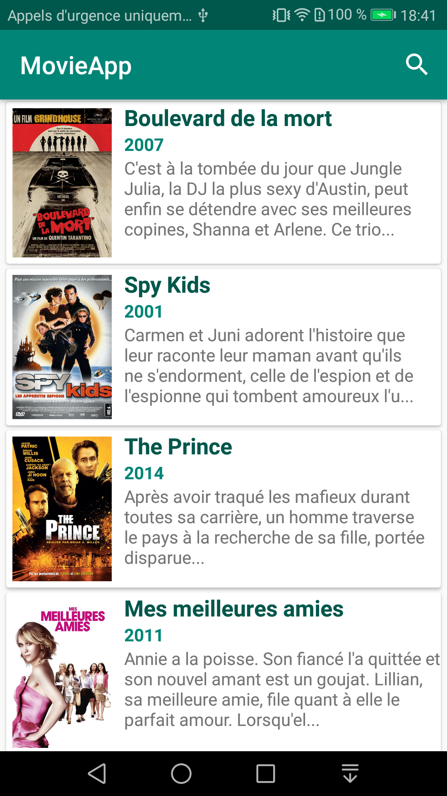
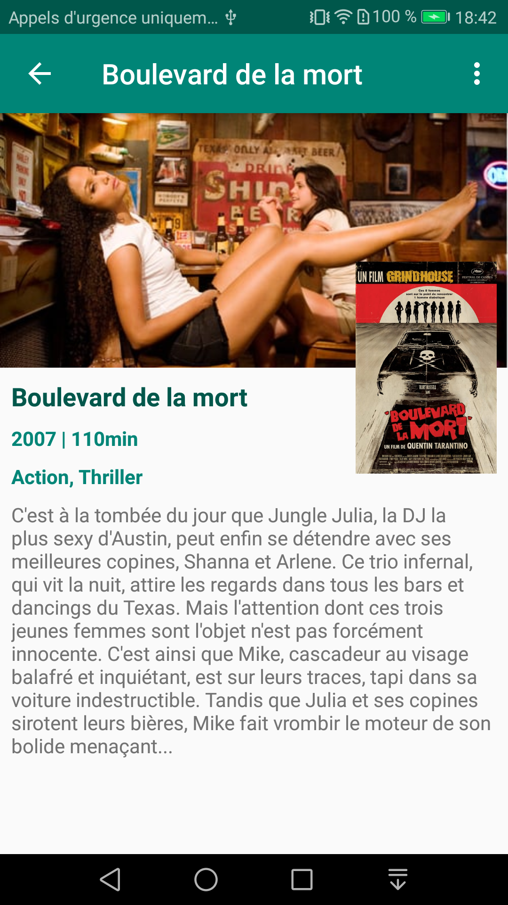

# MovieApp
Application android exploitant l'API 'The Movie Database' **themoviedb.org**.
Concepts mis en oeuvre
- RecyclerView & CardView
- Custom adapter
- Picasso
- Retrofit (couplé au convertisseur gson)
## Prérequis
- Android Studio
## Installation
Télécharger le .zip du projet, extraire le contenu dans le répertoire de votre choix et ouvrir ce répertoire dans Android Studio.
## Version SDK
- minSdkVersion : **19**  
- targetSdkVersion : **28**
## Librairies utilisées
- com.android.support:appcompat-v7:28.0.0
- com.android.support.constraint:constraint-layout:1.1.3
- com.android.support:recyclerview-v7:28.0.0
- com.android.support:cardview-v7:28.0.0
- com.squareup.retrofit2:retrofit:2.5.0
- com.squareup.retrofit2:converter-gson:2.4.0
- com.squareup.picasso:picasso:2.71828

